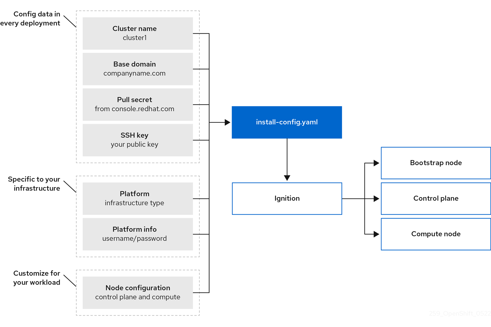

# OpenShift Cluster Setup on AWS
The OpenShift Container Platform installation program offers four methods for deploying a cluster:

1. **Interactive:** You can deploy a cluster with the web-based Assisted Installer. This is the recommended approach for clusters with networks connected to the internet. The Assisted Installer is the easiest way to install OpenShift Container Platform, it provides smart defaults, and it performs pre-flight validations before installing the cluster. It also provides a RESTful API for automation and advanced configuration scenarios.

2. **Local Agent-based:** You can deploy a cluster locally with the agent-based installer for air-gapped or restricted networks. It provides many of the benefits of the Assisted Installer, but you must download and configure the agent-based installer first. Configuration is done with a commandline interface. This approach is ideal for air-gapped or restricted networks.

3. **Automated:** You can deploy a cluster on installer-provisioned infrastructure and the cluster it maintains. The installer uses each cluster host’s baseboard management controller (BMC) for provisioning. You can deploy clusters with both connected or air-gapped or restricted networks.

4. **Full control:** You can deploy a cluster on infrastructure that you prepare and maintain, which provides maximum customizability. You can deploy clusters with both connected or air-gapped or restricted networks.

## About the installation program
We can use the installation program to deploy each type of cluster. The installation program generates main assets such as Ignition config files for the bootstrap, control plane (master), and worker machines. We can start an OpenShift Container Platform cluster with these three configurations and correctly configured infrastructure.

The OpenShift Container Platform installation program uses a set of targets and dependencies to manage cluster installations. The installation program has a set of targets that it must achieve, and each target has a set of dependencies. Because each target is only concerned with its own dependencies, the installation program can act to achieve multiple targets in parallel with the ultimate target being a running cluster. The installation program recognizes and uses existing components instead of running commands to create them again because the program meets dependencies.

Each cluster machine uses Red Hat Enterprise Linux CoreOS (RHCOS) as the operating system. RHCOS is the immutable container host version of Red Hat Enterprise Linux (RHEL) and features a RHEL kernel with SELinux enabled by default. It includes the kubelet, which is the Kubernetes node agent, and the CRI-O container runtime, which is optimized for Kubernetes.

Every control plane machine in an OpenShift Container Platform 4.12 cluster must use RHCOS, which includes a critical first-boot provisioning tool called Ignition. This tool enables the cluster to configure the machines.

### Technology Stack
Following technology stack is being used for the cluster provisioning:
- AWS Route 53
- AWS IAM 
- Domain provider (e.g. Namecheap)
- OpenShift Container Platform

## Pre-Requisites
Following prerequisites must be met before OpenShift cluster provisioning.
- Configure an **AWS account** to host the cluster.
- An **IAM user** with **Admin access**.  
- An **installer machine** to start the provisioning step. 
    - We can have a Virtual Machine on AWS acting as installer machine. 
- A **Domain name** to access the application deployed on OpenShift cluster.
- A RedHat account. 

## Step 1: Create a Public Hosted Zone using the Route 53 
I have already acquired domain name, i.e. **asadhanif.dev**, from Namecheap, Inc. 

Sign in to the **AWS Management Console** and open the **Route 53 console** at https://console.aws.amazon.com/route53/.

**Step 1 (a):** In the Create Hosted Zone pane, enter the name of the domain to route traffic for. Following image is presenting the created public hosted zone. 

**Step 1 (b):** Next step is to update the DNS records at Namecheap. 

## Step 2: Creating an IAM User on AWS

**Step 2 (a):** Create the **IAM user** with *administrator* access using the AWS Management Console.

**Step 2 (b):** We also need create access key to enable programmatic access, so that openshift can access and manage the aws account for resource provisioning.  

## Step 3: Generating a key pair for cluster node SSH access
During an OpenShift Container Platform installation, we can provide an SSH public key to the installation program. The key is passed to the Red Hat Enterprise Linux CoreOS (RHCOS) nodes through their Ignition config files and is used to authenticate SSH access to the nodes. The key is added to the `~/.ssh/authorized_keys` list for the `core` user on each node, which enables password-less authentication.

After the key is passed to the nodes, we can use the key pair to SSH in to the RHCOS nodes as the user `core`. To access the nodes through SSH, the private key identity must be managed by SSH for your local user.

If we want to SSH in to our cluster nodes to perform installation debugging or disaster recovery, we must provide the SSH public key during the installation process. The `./openshift-install gather` command also requires the SSH public key to be in place on the cluster nodes.

**Step 3 (a):** Create a VM on AWS witht the name **openshift-client**. This VM will be used to start the Ignition process of OpenShift cluster setup. 

**Step 3 (b):** If we do not have an existing SSH key pair on our virtual machine (i.e. `openshift-client`) to use for authentication onto our cluster nodes, create one. SSH to the VM using a Linux operating system, run the following command:

`ssh-keygen -t ed25519 -N ''` 

**Step 3 (c):** View the public key, placed at `~/.ssh/id_ed25519.pub`, using following command  public key:

`cat ~/.ssh/id_ed25519.pub`

**Step 3 (d):** Add the SSH private key identity to the SSH agent for local user, if it has not already been added. SSH agent management of the key is required for password-less SSH authentication onto our cluster nodes, or if we want to use the `./openshift-install gather` command.

If the ssh-agent process is not already running for local user, start it as a background task:

`eval "$(ssh-agent -s)"`

**Step 3 (e):** Add the SSH private key, placed in `~/.ssh/id_ed25519`, to the ssh-agent using following command:

`ssh-add ~/.ssh/id_ed25519`

**Note:** When we install OpenShift Container Platform, we'll provide the SSH public key to the installation program.

## Step 4: Installing a cluster on AWS with customizations

**Step 4 (a):** Go to the [OpenShift Console](https://console.redhat.com/openshift) to manage the cluster. 

**Step 4 (b):** Click on the **Create Cluster** button, following screen will be shown. Scrolldown to see the **Run it yourself** option, as shown in 2nd image.  

## Step x: Installing a cluster on AWS with customizations
In OpenShift Container Platform version 4.12, we can install a customized cluster on infrastructure that the installation program provisions on Amazon Web Services (AWS). To customize the installation, we need to modify parameters in the `install-config.yaml` file before installing the cluster.

